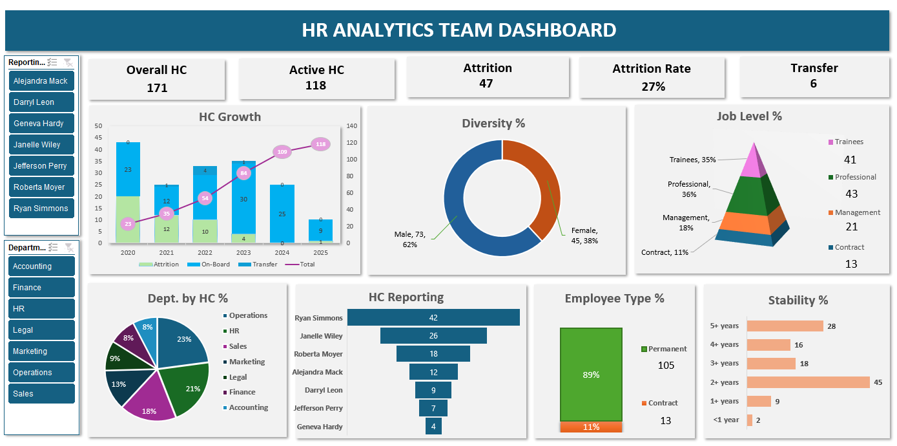

# 📊 HR Analytics Dashboard — Excel

An interactive HR Analytics Dashboard built in Microsoft Excel to track workforce trends, attrition patterns, diversity, and team structure across departments and reporting managers.

## 🖼️ Dashboard Preview

## 📌 Key Metrics

| Metric | Value |
|---|---|
| Total Headcount | 171 |
| Active (On-Board) | 118 |
| Total Attrition | 47 |
| Attrition Rate | 27% |
| Internal Transfers | 6 |

## 📈 Visualizations Included

- **HC Growth (2020–2025)** — Combo chart (bar + line) showing yearly Attrition, On-Board, Transfer, and cumulative Total trend
- **Diversity %** — Donut chart (Male 62%, Female 38%)
- **Job Level %** — Pyramid chart (Trainees 35%, Professional 36%, Management 18%, Contract 11%)
- **Dept. by HC %** — Pie chart across 7 departments (Operations, HR, Sales, Marketing, Accounting, Finance, Legal)
- **HC Reporting** — Horizontal bar chart showing headcount under each Reporting Manager
- **Employee Type %** — Permanent 89% (105) vs Contract 11% (13)
- **Stability %** — Bar chart showing employee tenure distribution (5+ years to <1 year)

## 🔧 Features

- **Reporting Manager Slicer** — Filter entire dashboard by manager (7 managers)
- **Department Slicer** — Drill down by department (7 departments)
- Dynamic KPI cards updating with slicer selections
- All charts connected via Pivot Tables for synchronized filtering

## 🛠️ Tools & Technologies

- **Microsoft Excel** — Dashboard design, layout, and formatting
- **Pivot Tables** — Data aggregation and dynamic calculations
- **Pivot Charts** — All 7 visualizations built on Pivot Table sources
- **Slicers** — Report Connections configured for cross-chart filtering
- **Conditional Formatting** — KPI card styling

## 📁 Files in This Repository
